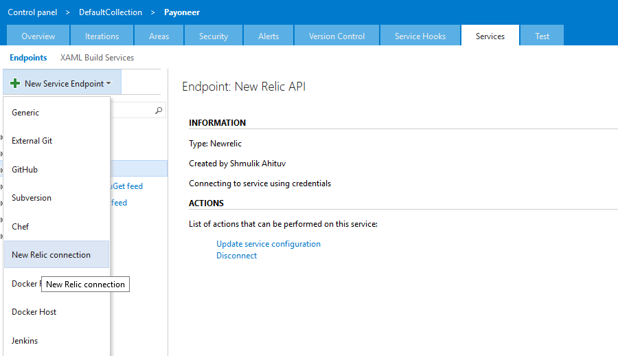
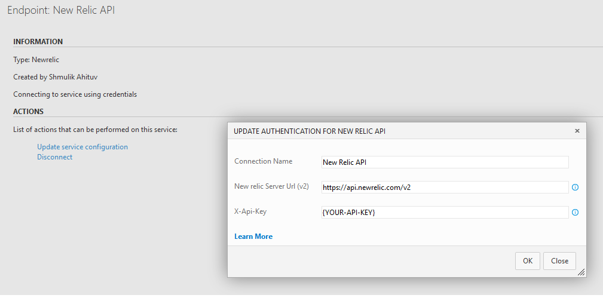
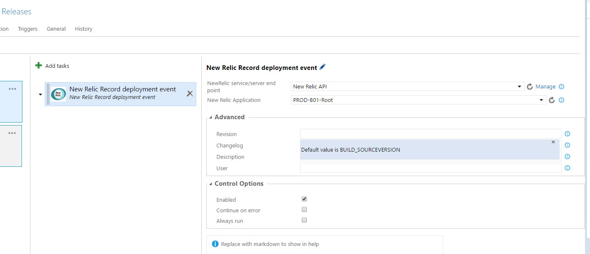

#New Relic Record Deployment Build/Release task#

**New Relic**

New Relic gives you deep performance analytics for every part of your software environment.
You can easily view and analyze massive amounts of data, and gain actionable insights in real-time. 
For your apps. For your users. For your business.

**Note:** The extension uses the V2 New Relic API.

**Discalimer:** These extension are neither developed nor endorsed by New Relic.
 

## Release Notes
* 1.0.0
    * First release

## Usage
This extensions contains a set of components for publish/record a new deployment event to your new relic account [New Relic](http://www.newrelic.com).
This extension installs the following :

* A new relic endpoint with Token based autetication scheme for connecting to your New Relic account
* A New relic task to:
    publish/record a deployment event of a given app to your New Relic account.
    It will add to the deployment event a valuebale data such as revision, changelog and description which will be reflected in the         deployment event of the specific application in your New Relic account.

What is great in this task is that it will auto-populate a picklist with all of your New Relic applications, according to your pre-defined New Relic secured endpoint.
You can override each and every argument (application, revision, changelog, description, user)
with your own value- if you choose to not use an application value from the picklist please make sure it is exists in your New Relic acccount.

##Steps

##Create a New Relic Endpoint:

##Open your build/release definition and add the New Relic record deployment event task.
**The task can be found in the Utility category of the Add Tasks dialog.**

Enter the required parameter values for the task:
**application**- can be picked from an auto-populate picklist with all of your New Relic applications, according to your pre-defined New Relic endpoint.

**revision**- if no value is specified, default value is BUILD_SOURCEVERSION

**changelog**- if no value is specified, default value is a link to the release summary (e.g http://YourTFSFQDN/tfs/DefaultCollection/TeamProject/_apps/hub/ms.vss-releaseManagement-web.hub-explorer?definitionId=18&_a=release-logs&releaseId=1618)

**description**- if no value is specified, default value is RELEASE_RELEASEDESCRIPTION

**user**- if no value is specified, default value isRELEASE_REQUESTEDFOR
